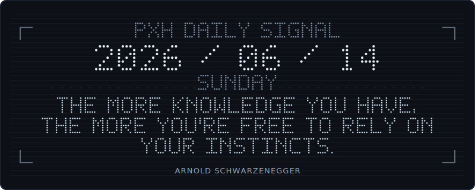
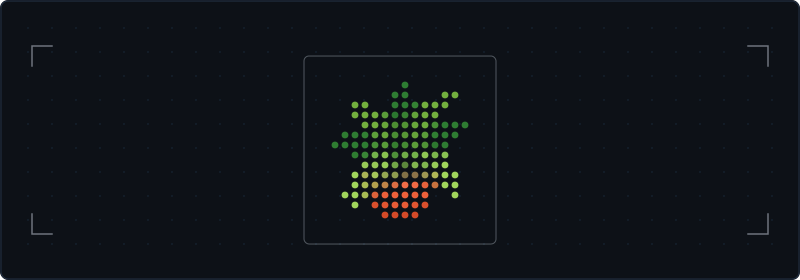

<p align="center">
    
</p>

<p align="center">
    
</p>

<!-- DOT_MATRIX:START -->
<p align="center">
    
    <br/>
    <sub>Quote powered by <a href="https://zenquotes.io/">ZenQuotes API</a>.</sub>
</p>
<!-- DOT_MATRIX:END -->

<!-- SIGNAL_CACHE:START -->
<p align="center">
    
</p>

<details>
<summary>Signal Cache decode key</summary>

```text
RUN: 20260517
QUOTE_SOURCE: ZenQuotes
QUOTE_AUTHOR: Albert Einstein
MODE: ATBASH
HINT: MIRROR MAP
ANSWER: LIGHT
DROP: Pixel Heart / COMMON
ICON: HEART
UPDATED: 2026 / 05 / 17 SUNDAY Asia/Shanghai
```

</details>
<!-- SIGNAL_CACHE:END -->

<p align="center">
    
</p>

<p align="center">
  <a href="https://github.com/pxh52013145"></a>
  
  
</p>

<p align="center">
    
</p>
